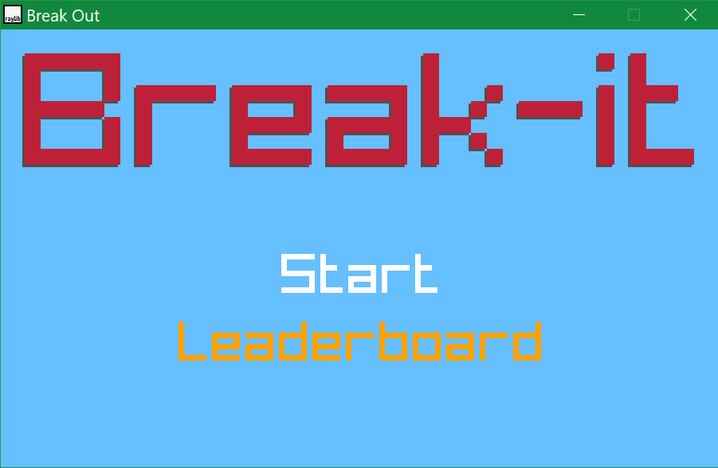

# Break Out Clone

### Description

This game is one of the GD50 projects, inspired by classic game **Break Out**.

## Built With

- [Raylib](https://www.raylib.com)

## Features

- Spritesheet texture
- Collision detection
- Emitters/Particles System
- Procedural generation
- Keyboard control
- Sound effects

### Gameplay

